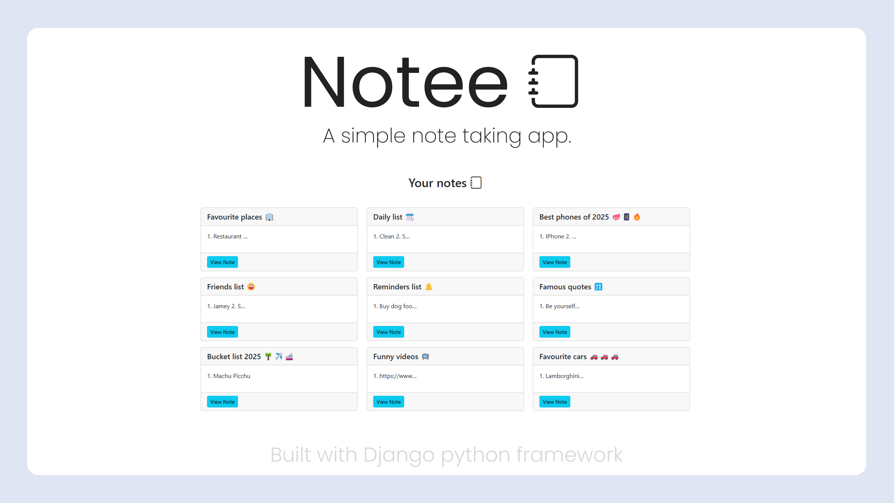

# Notee

## Project Overview
A simple note taking app.

**Acknowledge**  
This is my first ever app built. Please don`t judge. Thanks for reviewing project! : )  


## Prerequisites
Before you start, ensure you have the following installed on your machine:

- **Python 3.8+**
- **Django 3.0+**

You can install Python and Django by following the instructions on their official websites:
- [Python](https://www.python.org/downloads/)
- [Django](https://www.djangoproject.com/)

Alternatively, you can install Python and Django using `pip`.

### Install Python
If you don’t have Python installed, you can download it from [python.org](https://www.python.org/downloads/). Once installed, verify the installation by running:

```bash
python --version
```

### Install Django

You can install Django using pip. Open your terminal/command prompt and run:

```bash
pip install django
```

## Installation of the project
1. **Clone the project reposiotry** to your local machine  
  
    ```bash
    git clone https://github.com/IliyanGeorgiev87/Notee
    cd Notee
    ```
2. **Create a virtual environment**: It’s good practice to use a virtual environment to manage your project’s dependencies. Run the following commands:
  
    ```bash
    # For Windows:
    python -m venv venv
    venv\Scripts\activate

    # For Mac/Linux:
    python3 -m venv venv
    source venv/bin/activate
    ```
3. **Install the dependencies**: With the virtual environment activated, install the project dependencies:
    ```bash
    pip install -r requirements.txt
    ```
4. **Run migrations**
    ```bash
    python manage.py makemigrations
    ```
5. **Create a super user** or use existing one
    ```bash
    # create superuser (admin):
    python manage.py createsuperuser

    # or use existing one
    username: admin
    password: admin
    ```
6. **Go into the Notee folder**  
Run the following command
    ```bash
    cd Notee
    ```
7. **Run the development server**  
Start the development server with the following command:
  
    ```bash
    python manage.py runserver
    ```
      
    You should recieve output like this:
    ```bash
    Starting development server at http://127.0.0.1:8000/
    ```
## Usage
  - To use the app navigate to the following addres in your search bar:
    
    ```bash
    http://127.0.0.1:8000/
    ```
  - To enter the admin panel navigate to the following addres:
    ```bash
    http://127.0.0.1:8000/admin/
    ```
    now can log in into the provided account or the one created by you.

## Contributing
I am welcome for any contributions. Here is how to do it:  
  
1. Fork the repository on GitHub.
2. Create a new branch
    ```bash
    git checkout -b feature-name
    ```
3. Commit your changes
    ```bash
    git commit -am 'message'
    ```
4. Push to our forked repository:
    
    ```bash
    git push origin feature-name
    ```
5. Open a pull request

## License

<p xmlns:cc="http://creativecommons.org/ns#" xmlns:dct="http://purl.org/dc/terms/"><a property="dct:title" rel="cc:attributionURL" href="https://github.com/IliyanGeorgiev87/Notee">Notee</a> by <a rel="cc:attributionURL dct:creator" property="cc:attributionName" href="https://github.com/IliyanGeorgiev87">Iliyan Georgiev</a> is licensed under <a href="https://creativecommons.org/licenses/by-nc-sa/4.0/?ref=chooser-v1" target="_blank" rel="license noopener noreferrer" style="display:inline-block;">CC BY-NC-SA 4.0</a></p>
